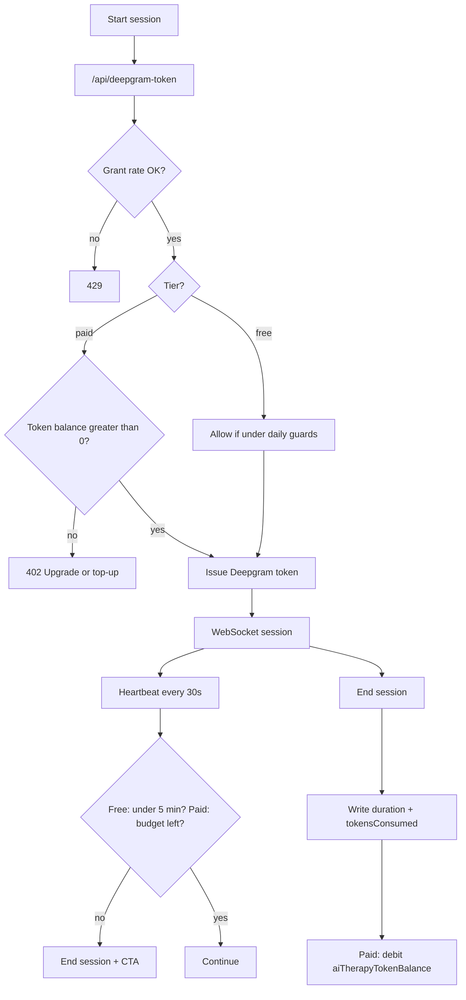

# AI Therapy — Future Plan: Rate Limits & Subscription Tiers

Follow-up to [plan.md](./plan.md). **Not in v1.** Add after voice sessions ship.

## Goal

Protect Deepgram + Deepseek spend and create a clear free → paid upgrade path for voice therapy.

## Tier model (locked)

|                                          | Free                                              | Paid (subscribed)                                                                     |
| ---------------------------------------- | ------------------------------------------------- | ------------------------------------------------------------------------------------- |
| **Primary limit**                        | **Time-based: 5 minutes** per session (hard stop) | **Token-driven** — billed/capped by LLM + voice usage tokens, not a fixed minute wall |
| Soft warning                             | at ~4 minutes                                     | when ~80% of token budget is used                                                     |
| Hard stop                                | at **5 minutes**                                  | when token budget is exhausted                                                        |
| Concurrent sessions                      | 1                                                 | 1                                                                                     |
| Token grant rate (`/api/deepgram-token`) | 5 / hour                                          | higher (e.g. 60 / hour)                                                               |
| Journal context in prompt                | smaller (~2k chars)                               | larger (~6k chars), still counted toward tokens                                       |
| After limit                              | Upgrade CTA                                       | Top-up / next billing cycle / wait for refill                                         |

### Free — 5 minute limit

- Each voice session hard-caps at **5 minutes** of connection time.
- Server enforces via heartbeat + session end; client shows countdown.
- Optional additional free guardrails later (e.g. N sessions/day) — secondary to the 5-minute rule.

### Paid — token-driven

- No fixed max session length like free.
- Usage is metered in **tokens** (and/or equivalent cost units), for example:
  - Deepseek input/output tokens from the Voice Agent “think” loop
  - Optional: map Deepgram Voice Agent connection minutes into a token-equivalent for one unified budget
- User has a **period token budget** (monthly allowance or prepaid pack).
- Session continues until budget hits zero (or user ends the call).
- UI shows remaining token budget (or “~X minutes left” estimate derived from recent burn rate).

Exact paid token allotment is TBD after measuring real burn rate (Deepgram $/min + Deepseek tokens/min of conversation).

## Data model (future)

```prisma
enum SubscriptionTier {
  FREE
  SUBSCRIBED
}

model User {
  // existing fields...
  subscriptionTier   SubscriptionTier @default(FREE)
  subscriptionEndsAt DateTime?
  // Paid: remaining or period budget (source of truth may also live on billing provider)
  aiTherapyTokenBalance Int @default(0)
}

model AiTherapyUsage {
  id                String   @id @default(cuid())
  userId            String
  user              User     @relation(fields: [userId], references: [id], onDelete: Cascade)
  startedAt         DateTime @default(now())
  endedAt           DateTime?
  durationSeconds   Int      @default(0)
  tokensConsumed    Int      @default(0) // LLM (+ optional voice-equivalent)
  @@index([userId, startedAt])
}
```

Billing is a **separate feature** — see [Paywall (Stripe)](../paywall/plan.md).  
AI Therapy only consumes `subscriptionTier` + `aiTherapyTokenBalance` after Stripe webhooks update them.

## Enforcement points



### 1. Rate limit — Deepgram access-token grants

- Upstash Redis (`lib/upstash.ts`)
- Key: `ai-therapy:token:{userId}:{window}`
- Free: 5 grants / rolling hour
- Paid: higher cap
- Apply in `/api/deepgram-token` before Deepgram `auth/grant`

### 2. Free quota — 5 minute hard cap

- Client timer + server heartbeat validation
- At 5:00 force disconnect; reject further audio / require new session only if still free-eligible
- Record `durationSeconds` (capped at 300)

### 3. Paid quota — token-driven

- On each turn or on session end: attribute `tokensConsumed` (from Deepseek usage if available; else estimate from transcript length)
- Debit `aiTherapyTokenBalance`
- If balance hits 0 mid-session → graceful end + top-up CTA
- Session start rejected when balance is 0

### 4. Context budget

- Cap journal context chars by tier when building `agent.think.prompt`
- Context tokens count against paid budget

## UI (future)

- **Free:** countdown “X:XX left in this free session” → at 0, upgrade modal
- **Paid:** “Tokens remaining” (and optional estimated minutes)
- Soft warning near 80% of free time or paid budget
- Settings / billing: plan status, balance, top-up

## Env / config (future)

```env
AI_THERAPY_FREE_MAX_SESSION_MINUTES=5
AI_THERAPY_FREE_SOFT_WARNING_SECONDS=240
AI_THERAPY_PAID_DEFAULT_MONTHLY_TOKENS=500000
# Optional: convert Deepgram minutes into token-equivalents for one meter
AI_THERAPY_VOICE_MINUTE_TOKEN_EQUIV=1000
```

## Implementation order (when ready)

1. Prisma `subscriptionTier`, `aiTherapyTokenBalance`, `AiTherapyUsage`
2. Redis rate limit on `/api/deepgram-token`
3. Free 5-minute hard cap (client + server)
4. Paid token metering + balance debit
5. Stripe paywall webhooks → tier + token refill — see [../paywall/plan.md](../paywall/plan.md)
6. Upgrade / top-up CTAs → paywall Checkout

## Out of scope for this future doc

- Enterprise / team plans
- Per-org shared pools
- True E2E / self-hosted Deepgram
- Refunds for partial sessions
- Paywall implementation details (owned by `docs/feature/paywall/`)
