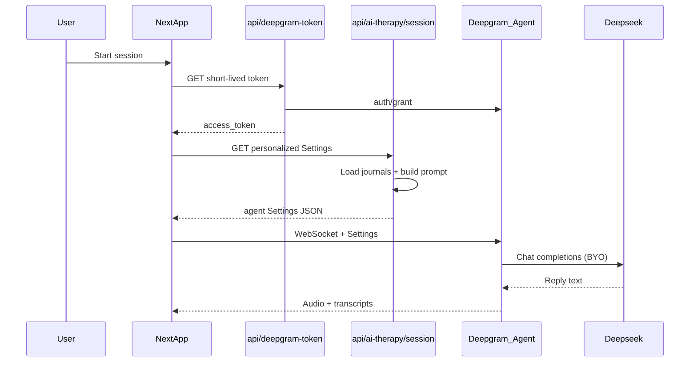

# Deepgram AI Therapy Sessions

Feature plan for `/user/ai-therapy` — personalized voice therapy via Deepgram Voice Agent + Deepseek.

Related: [future-plan.md](./future-plan.md) — rate limits (post-v1).  
Paywall (Stripe) is a **separate feature:** [../paywall/plan.md](../paywall/plan.md).  
Chatbot is a **separate feature:** [../chatbot/plan.md](../chatbot/plan.md).

## Decisions locked in

- **Stack:** Deepgram Voice Agent API + Deepseek (BYO LLM via OpenAI-compatible endpoint)
- **Privacy UI:** Remove the “end-to-end encrypted / never touch external servers” claim; replace with honest copy (TLS in transit, we don’t store session audio, educational not clinical)
- **Auth:** `DEEPGRAM_API_KEY` stays **server-only** in `.env` (never `NEXT_PUBLIC_`). Browser gets short-lived tokens via Deepgram grant API
- **Key handling:** Add `DEEPGRAM_API_KEY` to local `.env` during implementation. Rotate any key that was shared outside `.env`

## Can we customize the agent for the product claims?

| Claim | Feasible? | How |
| --- | --- | --- |
| Evidence-based voice therapist | Yes | Fixed system prompt in `agent.think.prompt` (CBT/DBT/ACT-informed, crisis redirect, no diagnosis) |
| Personalized to journal/mood | Yes | At session start, server loads recent journals and injects a compact summary into the prompt / `agent.context` |
| Private E2E / no external servers | No (cloud) | Drop claim; honest privacy bullet instead |
| Available anytime | Yes | On-demand browser WebSocket session, no scheduling |

Deepgram supports inline agent config, mid-session `UpdatePrompt`, and BYO LLM with custom `endpoint` — so personalization is first-class.

## Implementation

### 1. Env + deps

- Add to `.env` (gitignored): `DEEPGRAM_API_KEY=...`
- Document in `CLAUDE.md` / `README.md`: `DEEPGRAM_API_KEY` (server-only)
- Install `@deepgram/react` (brings `@deepgram/agents`) for hooks + mic/player
- Leave Millis/Vapi packages unused for now (session will stop importing them)

### 2. Server routes

- `app/api/deepgram-token/route.ts` — Clerk-auth’d; `POST https://api.deepgram.com/v1/auth/grant` with `DEEPGRAM_API_KEY`; return short TTL token (~30–60s)
- `app/api/ai-therapy/session/route.ts` — Clerk-auth’d; load last ~14 days of journals (title, mood, truncated content) via Prisma (same pattern as `app/api/insights/route.ts`); return Deepgram **Settings** payload:
  - `listen`: Nova-3
  - `think`: `open_ai` + `endpoint.url` = Deepseek OpenAI-compatible chat URL + `Authorization: Bearer ${DEEPSEEK_API_KEY}`; `prompt` = therapist persona + journal context (cap size)
  - `speak`: Aura-2 calm English voice
  - `greeting`: short supportive opener
- Shared prompt builder in `lib/ai-therapy-prompt.ts` — crisis language, no diagnosis, redirect to 988/emergency

### 3. Landing UI (`app/(protected)/user/(therapy)/ai-therapy/_components/therapist.tsx`)

- Remove “Coming soon” gate
- Replace privacy feature with honest wording, e.g. “Encrypted in transit; we don’t store your session audio”
- Keep other three features; add primary CTA → `/user/ai-therapy/session`
- Alan styling (`rounded-2xl` icon tiles)

### 4. Session UI

- Stop redirect in `app/(protected)/user/(therapy)/ai-therapy/session/page.tsx`; render session client
- Rewrite `session/_components/ai-session.tsx`:
  - Remove Millis/Vapi
  - `tokenFactory` → `/api/deepgram-token`
  - Fetch Settings from `/api/ai-therapy/session` before connect
  - Wire start/end, mute, speaking state, timer, crisis disclaimer
  - Restyle to Alan panels (drop gray/shadow glassmorphism)

### 5. Safety + product guardrails

- Persistent crisis disclaimer on landing + session (keep 988 / emergency)
- Empty-journal path: still allow session with generic prompt (“no recent journal context yet”)
- Soft limit: session length warning (e.g. 20 min) to protect free credits — UI only for v1

### 6. Out of scope (v1)

- Persisting transcripts to DB
- True E2E / self-hosted Deepgram
- Phone/SIP
- Admin AI therapy parity
- **Rate limits / subscription quotas** — see [future-plan.md](./future-plan.md)

## Files touched (expected)

- `.env` (local only), `CLAUDE.md`, `README.md`, `package.json`
- New: `app/api/deepgram-token/route.ts`, `app/api/ai-therapy/session/route.ts`, `lib/ai-therapy-prompt.ts`
- Update: `therapist.tsx`, `session/page.tsx`, `ai-session.tsx`
- Docs: this file (`docs/feature/ai-therapy/plan.md`), future limits (`docs/feature/ai-therapy/future-plan.md`)
- Remove Millis usage from session; keep `lib/millis.ts` / `lib/vapi.ts` dead until cleaned later

## Implementation todos

1. Add `DEEPGRAM_API_KEY` to `.env`; install `@deepgram/react`; document env vars
2. Create Clerk-auth’d `/api/deepgram-token` grant route
3. Create `/api/ai-therapy/session` with journal-personalized Deepgram Settings + Deepseek BYO
4. Add evidence-based therapist prompt builder with crisis guardrails
5. Update `therapist.tsx`: remove Coming soon + E2E claim; add Start session CTA
6. Re-enable session page; rewrite `ai-session.tsx` on Deepgram hooks + Alan UI
