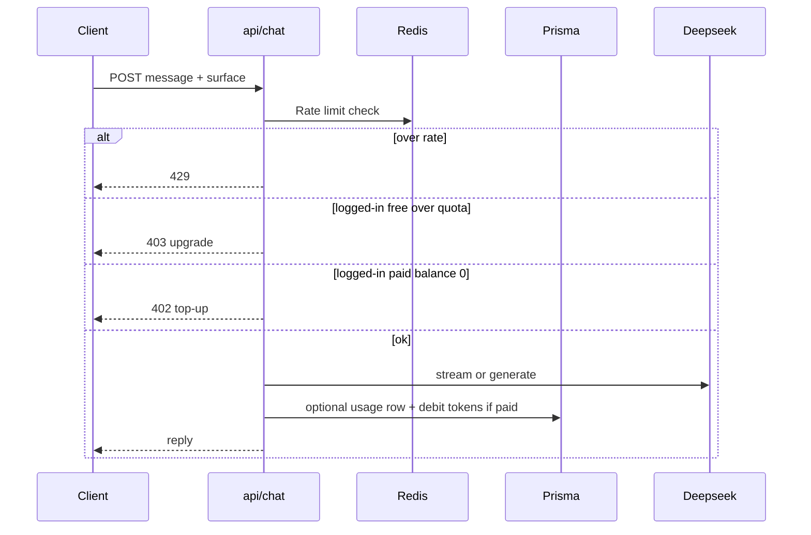

# Chatbot

Separate product feature — conversational assistant on the **marketing landing page** and inside the **logged-in `/user` app**.

**Related**
- Existing stub UI: `app/_components/chat-panel.tsx` (fab only; no real LLM yet)
- Limits / billing: [Paywall (Stripe)](../paywall/plan.md)
- LLM: Deepseek (same as rest of app via `lib/ai.ts`)

## Surfaces

| Surface | Who | Limit model |
| --- | --- | --- |
| Landing page (public) | Anonymous visitors | **Rate limited** only (IP / anonymous session) — no paid tokens |
| Logged-in app | Authenticated users | **Free:** hard message/day (or token) cap → upgrade CTA; **Paid:** **token-driven** (shared Stripe balance) |

## Implementation status (v1 shipped)

- Shared Alan widget: `components/chatbot/chatbot-widget.tsx`
- Landing: `app/_components/chat-panel.tsx` → guest rate limit
- App: mounted in `components/wrappers/user-layout.wrapper.tsx`
- API: `POST /api/chat`, `GET /api/chat/usage`
- Limits: Redis (Upstash) for landing rate + free daily messages; paid uses `User.aiTokenBalance` when `subscriptionTier = SUBSCRIBED`
- Prisma: `SubscriptionTier`, `aiTokenBalance`, Stripe id fields on `User` (paywall fills later)

Run `npx prisma db push` if the DB is reachable so new User columns exist.

## Decisions locked in

- **Model:** Deepseek chat (`deepseek-chat`) via existing server routes — never expose `DEEPSEEK_API_KEY` to the client
- **Landing:** Redis rate limits (Upstash already in stack); no account required
- **Logged-in free:** fixed daily (or monthly) message / token allowance
- **Logged-in paid:** debit `aiTherapyTokenBalance` or a dedicated `chatTokenBalance` synced by Stripe paywall (prefer **one shared wallet** unless product wants separate meters)
- **UI:** Replace purple stub with Alan-styled panel; reuse pattern on landing + `/user` shell
- **Safety:** Crisis redirect copy; not a therapist; no medical diagnosis

### Shared wallet (default)

Use one Stripe-backed balance (`aiTherapyTokenBalance` or rename to `aiTokenBalance`) for:
- AI Therapy (voice)
- Chatbot (text)

Simpler paywall, one top-up, one upgrade CTA.

## Proposed limits (tunable)

| | Landing (anon) | Free (logged-in) | Paid (logged-in) |
| --- | --- | --- | --- |
| Messages / day | 10 / IP | 20 / user | Token budget |
| Max tokens / request | 512 out | 1k out | 2k out |
| History window | Last 6 turns (client) | Last 12 turns | Last 20 turns |
| Rate (Redis) | 10 req / 10 min / IP | 30 req / 10 min / user | Higher |
| On limit | “Sign up for more” | Upgrade CTA → Stripe | Top-up CTA → Stripe |

## Architecture



## Implementation (when ready)

### API

- `POST /api/chat` — body: `{ messages, surface: "landing" | "app" }`
  - Landing: identify by IP (+ optional anonymous cookie id); Redis sliding window
  - App: `getUserId()`; check free quota or paid balance; stream response preferred
- Optional `GET /api/chat/usage` — remaining quota for UI meter

### Prompt

- `lib/chatbot-prompt.ts` — HealthMind product assistant + wellness companion tone; crisis lines; no diagnosis
- Landing prompt: product Q&A + light wellness; push sign-up
- App prompt: can optionally include short journal/mood summary (like AI therapy) — v2 if needed

### UI

1. **Landing** — rewrite `chat-panel.tsx` (Alan tokens, working input, streaming bubbles, rate-limit toast)
2. **Logged-in** — mount same component (or shared `components/chatbot/`) in user layout / dashboard; show remaining free messages or token balance
3. Empty / limit states → Sign in / Upgrade / Top up (paywall Checkout)

### Data (optional v1)

```prisma
model ChatUsage {
  id             String   @id @default(cuid())
  userId         String?  // null for landing anon keyed separately in Redis
  surface        String   // landing | app
  tokensIn       Int      @default(0)
  tokensOut      Int      @default(0)
  createdAt      DateTime @default(now())
  @@index([userId, createdAt])
}
```

Landing usage can stay Redis-only for v1 (no DB row).

### Env

```env
# Optional overrides
CHAT_LANDING_RPM=10
CHAT_LANDING_WINDOW_SECONDS=600
CHAT_FREE_DAILY_MESSAGES=20
```

## Out of scope (v1)

- Voice in chatbot (that’s AI Therapy)
- Persistent chat history across devices (nice-to-have later)
- Admin chatbot
- Tool calling / browsing

## Implementation order

1. Shared chatbot UI component (Alan) + landing wiring  
2. `POST /api/chat` + Deepseek + landing Redis rate limit  
3. Logged-in free daily cap  
4. Paid token debit (shared wallet with paywall)  
5. Usage meter + upgrade/top-up CTAs  
6. Optional journal-aware app prompt  

## Docs layout

```
docs/feature/chatbot/plan.md   ← this file
docs/feature/paywall/plan.md   ← Stripe wallet this feature consumes
```
