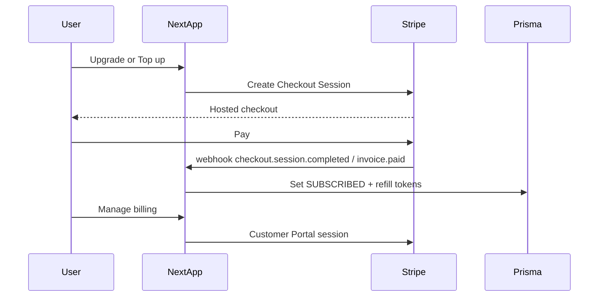

# Paywall (Stripe)

Separate product feature — subscriptions, token top-ups, and Customer Portal.  
Consumed by **AI Therapy**, **Chatbot**, and any future paid surfaces.

**Related**

- [AI Therapy future limits](../ai-therapy/future-plan.md) (free 5-min cap; paid token-driven)
- [Chatbot](../chatbot/plan.md) (landing rate limit; logged-in free cap / paid tokens)

## Decision locked in

- **Provider:** [Stripe](https://stripe.com) — Checkout + Billing + Customer Portal (+ optional Billing Meters for token usage)
- **Auth:** Keep Clerk for identity; map `clerkUserId` ↔ Stripe `customer.id` in Prisma
- **Not using:** Polar, Lemon Squeezy, Paddle, Clerk Billing (for this feature)

## Why Stripe for HealthMind

| Need                         | Stripe fit                                                                                               |
| ---------------------------- | -------------------------------------------------------------------------------------------------------- |
| Token-driven paid AI therapy | Billing Meters / metered prices, or prepaid token packs as one-time PaymentIntents / checkout line items |
| Subscriptions                | Stripe Billing (monthly Pro with included token allotment)                                               |
| Upgrade CTAs in-app          | Checkout Sessions (hosted) — fast, PCI-safe                                                              |
| Cancel / invoices            | Customer Portal                                                                                          |
| Fees at scale                | Typically lower than MoR platforms (you handle tax via Stripe Tax if needed)                             |

## Products (sketch)

1. **Pro subscription** — monthly; refills `aiTherapyTokenBalance` each period
2. **Token top-up packs** — one-time Checkout (e.g. Small / Medium / Large)
3. Optional later: metered overage via Stripe Billing Meters when balance hits zero

## Data model (shared with consumers)

```prisma
model User {
  // existing...
  subscriptionTier     SubscriptionTier @default(FREE)
  subscriptionEndsAt   DateTime?
  stripeCustomerId     String?   @unique
  stripeSubscriptionId String?   @unique
  aiTherapyTokenBalance Int      @default(0)
}
```

Webhook is source of truth for tier + balance — never trust the client.

## Architecture



## Implementation (when ready)

### Env

```env
STRIPE_SECRET_KEY=
STRIPE_WEBHOOK_SECRET=
NEXT_PUBLIC_STRIPE_PUBLISHABLE_KEY=
STRIPE_PRICE_PRO_MONTHLY=
STRIPE_PRICE_TOPUP_SMALL=
STRIPE_PRICE_TOPUP_MEDIUM=
STRIPE_PRICE_TOPUP_LARGE=
```

### Routes

- `POST /api/stripe/checkout` — auth’d; create Checkout Session (mode `subscription` or `payment`)
- `POST /api/stripe/portal` — auth’d; Customer Portal session
- `POST /api/webhooks/stripe` — verify signature; sync `subscriptionTier`, `stripeSubscriptionId`, token refills/top-ups

### UI

- Pricing / upgrade page under `/user` (Alan-styled)
- CTAs from AI Therapy when free 5-min cap or paid token budget hits zero
- “Manage billing” in user menu → Portal

### Libs

- `stripe` Node SDK
- Optional `@stripe/stripe-js` only if embedding Elements later (v1 can be Checkout-only)

## Out of scope (v1 paywall)

- Merchant of Record / automatic global VAT without Stripe Tax
- Team / org billing
- Mobile IAP
- Migrating historical Millis/Vapi spend

## Implementation order

1. Stripe account + products/prices
2. Prisma Stripe fields on `User`
3. Checkout + Portal API routes
4. Webhook sync (subscribe, renew, cancel, top-up)
5. Pricing / upgrade UI
6. Wire AI Therapy + Chatbot CTAs to this feature
