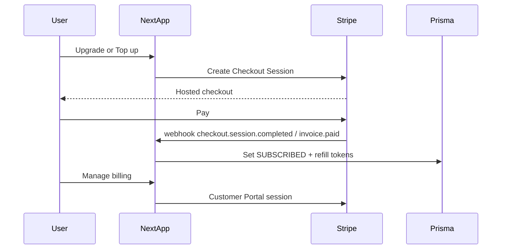

# Paywall (Stripe)

Separate product feature — subscriptions, token top-ups, and Customer Portal.  
Consumed by **AI Therapy**, **Chatbot**, and any future paid surfaces.

**Related**

- [AI Therapy future limits](../ai-therapy/future-plan.md) (free 5-min cap; paid token-driven)
- [Chatbot](../chatbot/plan.md) (landing rate limit; logged-in free cap / paid tokens)
- [Manual test](./manual-test.md)

## Decision locked in

- **Provider:** [Stripe](https://stripe.com) — Checkout + Billing + Customer Portal
- **Auth:** Keep Clerk for identity; map `clerkUserId` ↔ Stripe `customer.id` in Prisma
- **Wallet field:** `User.aiTokenBalance` (shared chat + therapy) — not `aiTherapyTokenBalance`
- **Not using:** Polar, Lemon Squeezy, Paddle, Clerk Billing (for this feature)
- **Top-ups:** only for `SUBSCRIBED` users; FREE users upgrade to Pro first

## Products (v1 placeholders)

| SKU           | Mode         | Display | Tokens                                                      |
| ------------- | ------------ | ------- | ----------------------------------------------------------- |
| Pro monthly   | subscription | $19/mo  | **set** balance to **50_000** on subscribe / `invoice.paid` |
| Top-up Small  | payment      | $5      | **+10_000**                                                 |
| Top-up Medium | payment      | $12     | **+30_000**                                                 |
| Top-up Large  | payment      | $25     | **+80_000**                                                 |

Token grants live in [`lib/stripe-catalog.ts`](../../../lib/stripe-catalog.ts), keyed by env Price IDs.

## Data model

```prisma
model User {
  subscriptionTier     SubscriptionTier @default(FREE)
  subscriptionEndsAt   DateTime?
  stripeCustomerId     String?   @unique
  stripeSubscriptionId String?   @unique
  aiTokenBalance       Int       @default(0)
}
```

Webhook is source of truth for tier + balance — never trust the client.

## Architecture



## Env

```env
STRIPE_SECRET_KEY=
STRIPE_WEBHOOK_SECRET=
NEXT_PUBLIC_STRIPE_PUBLISHABLE_KEY=
STRIPE_PRICE_PRO_MONTHLY=
STRIPE_PRICE_TOPUP_SMALL=
STRIPE_PRICE_TOPUP_MEDIUM=
STRIPE_PRICE_TOPUP_LARGE=
```

Create Prices via Dashboard or `node --env-file=.env scripts/create-stripe-catalog.mjs`.

## Routes

- `GET /api/billing/status` — tier, balance, catalog display
- `POST /api/stripe/checkout` — auth’d Checkout Session
- `POST /api/stripe/portal` — Customer Portal session
- `POST /api/webhooks/stripe` — signature-verified sync

## UI

- [`/user/billing`](<../../../app/(protected)/user/billing/page.tsx>) — Alan DESIGN.md / PRODUCT.md (tinted panels, calm copy)
- Nav user menu → Billing
- Chatbot Upgrade → `/user/billing`
- AI Therapy free-cap / token CTAs → `/user/billing`

## Therapy consumers (shipped with paywall v1)

- Free: hard stop at **5 minutes** (warning at 4)
- Paid: `/api/deepgram-token` requires `aiTokenBalance > 0`; heartbeat debits ~500 tokens/min
- Grant rate limits via Redis (free 5/hr, paid 60/hr)
- Session UI: remaining tokens + ~minutes left; warn at 80% of session opening balance
- `AiTherapyUsage` ledger: start / heartbeat touch / end with duration + tokensConsumed

## Out of scope

- Stripe Tax / MoR, team billing, mobile IAP, Billing Meters, real Deepgram burn metering
